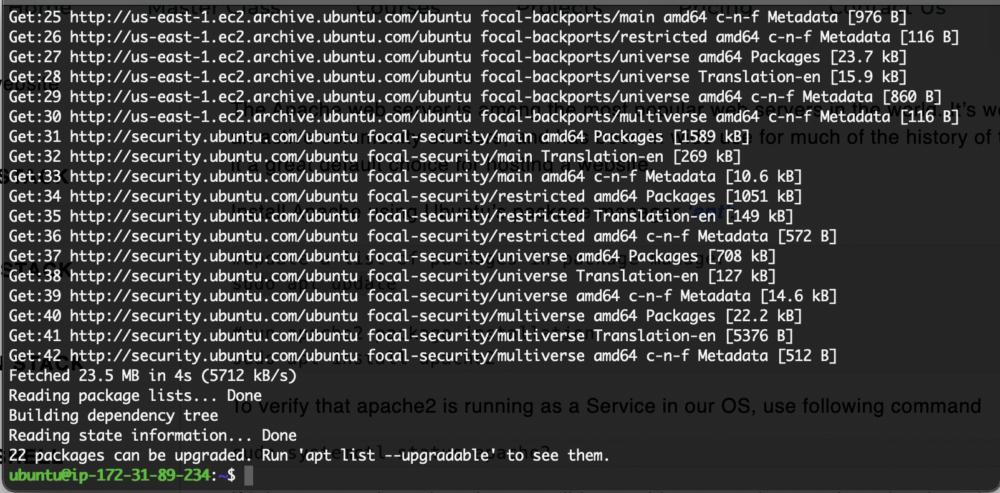

# PROJECT 1: LAMP STACK IMPLEMENTATION

## STEP 1: Installing Apache Web Server

===============

### 1) Install apache using Ubuntu's package manager "apt"
---------------
#### Update a list of packages in package manager with the run command below:

`sudo apt update`

Install Apache by running the following command:

`sudo apt install apache2`